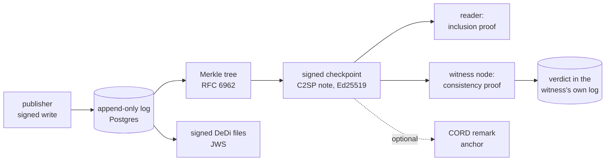

# Architecture

What each part of the node proves, and what it does not. The short version: the
log makes history *checkable*, witnesses make it *checked*, replication keeps it
*up*, and none of those three is a substitute for another.

## The log

Every change is an append: a new version of a namespace, registry or record.
Nothing is edited or deleted; a revocation is a new version whose state is
`revoked`. Each version becomes one leaf of a Merkle tree, hashed with
`tlog.RecordHash` from `golang.org/x/mod/sumdb/tlog` (the code behind Go's
checksum database) over a fixed encoding of:

`entry_type, namespace, registry, record_name, version_num, sha256(payload), created_by, created_at`

The payload enters the leaf by its digest, so a proof covers the exact bytes:
the digest is SHA-256 over the compacted JSON, and a reader recomputes it from
the `details` they were served. `created_by` is in the leaf, so who wrote a
version (`publisher:<kid>`, `witness`, `crawler:…`) is covered by the proof
too.

**Checkpoints.** Every `DEDI_CHECKPOINT_INTERVAL` (30 s) the node signs the
tree's size and root as a [C2SP checkpoint](https://c2sp.org/tlog-checkpoint)
in [signed-note](https://c2sp.org/signed-note) form, with its Ed25519 identity
key. Nothing is signed while the tree is unchanged. Two different roots at one
size would be a fork under the node's own key, and the store refuses to save
one.

**Inclusion proofs.** `?proof=inclusion` on a lookup returns the leaf, its
index, the RFC 6962 audit path, and a checkpoint that covers it. With the
node's verifier key a reader checks all of it offline: the signature, then the
path from the leaf to the signed root. `/verify` does this in the browser.

**Consistency proofs.** `/dedi/log/proof/consistency?old=N&new=M` proves the
tree of size N is a prefix of the tree of size M: nothing in the first N
leaves changed. This is the append-only property, and it is only worth
something to someone who kept the older checkpoint.

This is a Merkle log, not a blockchain. There is one writer, no consensus among
mutually distrusting parties, and no token. The threat it addresses is an
operator rewriting history; the defence is that a rewrite cannot be made
consistent with a checkpoint someone else already holds.

## Witnessing

A witness is another node, set with `DEDI_WITNESS_TARGET_*`, that fetches the
target's checkpoint, verifies its signature, asks for a consistency proof from
the last size it saw, and records the verdict (`size`, `root`,
`consistency_ok`) as a record in **its own** log, under `_witness`. Verdicts are
published at `/dedi/witness`. Nodes are usually arranged in a ring, each
watching the next. Details: [witnessing](witnessing.md).

What a verdict proves: that this witness saw the target's log only ever extend,
across every checkpoint it fetched, and it committed to that in a log that is
itself append-only and normally itself witnessed. A rewrite the witness saw is
a permanent, signed, `revoked`-state entry.

What it does not prove:

- **It is not a cosignature.** The witness does not sign the target's
  checkpoint (the C2SP `tlog-witness` protocol is not implemented), so a reader
  cannot be handed a checkpoint carrying the witness's signature. To use a
  verdict, compare the `size` and `root` it records with the checkpoint you
  were served, or redo the consistency check yourself.
- **It does not see what others were shown.** A target could serve the witness
  one history and you another. A verdict helps only if you compare against it.
- It says nothing about whether the *content* is true, only that it was not
  rewritten.

## Replication

`DEDI_CLUSTER_*` turns on Raft (hashicorp/raft). Replicas share one identity
key and one origin; the leader alone appends and signs, and each replica
applies the same command stream to its own database and computes the same
tree. Every replica serves reads; most writes to a follower are redirected to the
leader; the exceptions are listed in [replication](replication.md).

Raft tolerates crashed machines, not lying ones. Three replicas run by one
operator agree with that operator. Replication is availability, and it carries
no trust claim.

## Delegation

A parent node grants a child node one namespace one level below its own. The
child generates its own key, so the parent cannot sign as it; enrolment
presents the child's public key with a one-time token. The grant, the child's
key and any revocation are records in the parent's log under `_delegations`, so
"who holds this namespace, since when" has an inclusion proof. The parent then
witnesses the child. Revocation withdraws the grant; it does not stop the
child, and it is not transitive, so a relying party walks the whole chain.
Details: [delegation](delegation.md).

## Domain binding

A namespace's `domain` is a claim until checked. The node derives a TXT
challenge from the namespace, the domain and its own verifier key, to be
published at `_dedi-challenge.<domain>`; `POST …/domain/verify` resolves it
live and records the verdict in `_domains`. The token is non-transferable: it
proves nothing for another namespace, domain or node.

## File publication and crawling

The DeDi standard's other surface is signed files rather than an API. The node
serves a signed manifest at `/.well-known/dedi.index.json` and one file per
registry, signed as a detached JWS (EdDSA over JCS-canonical JSON) with the same
identity key. Revoked records are listed in a per-namespace revocations
registry, not dropped silently. Details: [file publication](file-publication.md).

With `DEDI_CRAWL_DOMAINS` the node also reads other publishers' files,
verifies them, and serves their records at the standard's lookup paths, never
re-signing them as its own. Details: [crawler and mirror](crawl-mirror.md).

## Anchoring

With `DEDI_ANCHOR_BACKEND=cord` the node submits its latest checkpoint to a
CORD chain as a `System.remark` whenever the tree has grown, and keeps the
receipt in an `anchors` table outside the log. It adds an external, ordered
timeline of roots, which makes backdating and serving different histories
harder. It is secondary to witnessing, and a chain you run yourself adds
ordering, not independent trust.

## Push

A webhook subscription is told, signed with the node's identity key, which log
entry changed and where to read it, never the payload. The consumer re-reads
and checks the proof; the push only removes the wait. Details: [push](push.md).
