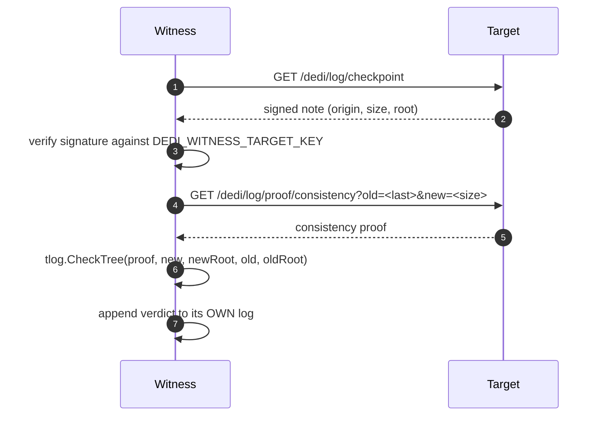

# Witnessing

One node checking, on a schedule, that another node's log has only ever been
appended to — and recording what it found in its own log, where the target
cannot reach it. This is the part of the design that turns "trust the operator"
into "check the operator", and it is the reason a DeDi node is worth more than
a well-run database.

Status: implemented. Turn it on with `DEDI_WITNESS_TARGET_*`; see
[deployment modes](/docs/deployment-modes) for how the planes compose.

## The problem it solves

A transparency log makes a node's history *checkable*. It does not make it
*checked*.

A node signs a checkpoint over its Merkle tree, and anyone holding two
checkpoints can demand a consistency proof between them. That is a real
guarantee, but it only binds an operator who is being watched — and the party
best placed to watch is the one least motivated to. If the only copies of
yesterday's checkpoint live on the node that issued it, an operator who rewrites
history has to fool nobody: they re-sign, and the new history is the only one
anyone has ever seen.

Witnessing fixes the custody problem, not the cryptography. Another node keeps
the old checkpoint, and it is the *keeping* that matters.

## What a witness actually does

Every `DEDI_WITNESS_INTERVAL` (default 60s):



The verdict is an ordinary record in the witness's log, under the reserved
`_witness` namespace, with `consistency_ok` in the payload. A failed check is
recorded with `state: revoked`, so an alarm is a published, signed, permanent
entry rather than a log line that scrolls away.

That last point is the whole design. The witness does not email anyone. It
writes down what it saw, in a log that is itself append-only and itself
witnessed, so the evidence outlives the incident and the person who noticed.

## The three failures it is built to catch

**The tree shrank.** `size < last` is impossible for an append-only log. No
proof is fetched; the verdict is `consistency_ok: false` immediately.

**The tree grew, but not from what was there before.** This is what the RFC 6962
consistency proof answers, and `tlog.CheckTree` is the check. If the old root is
not derivable as a prefix of the new tree, something was edited on the way past.

**The tree did not move, but its contents changed.** The subtle one, and the
attack that needs no growth at all: swap a leaf, re-sign at the same height. A
witness that compares sizes sees a quiet period and skips the check. So an
unchanged size is only treated as unchanged if the *root* still agrees:

> a matching size with a different root is not a quiet period, it is
> equivocation

and it is recorded as an alarm rather than skipped. The comment saying so is in
`internal/witness/witness.go`, at the branch that does it.

## A stalled witness is not a passing witness

The failure mode that nearly got past us: a witness records `consistency_ok:
true`, then starts failing on every subsequent run — network, key rotation,
target moved — and its stored verdict keeps saying `consistency_ok: true`
forever. Every dashboard reading verdicts stays green while nothing is being
checked.

Verdict age cannot distinguish the two. A witness writes nothing while its
target's tree is unchanged, so on a quiet network the newest verdict is
legitimately hours old.

So the node reports its own liveness separately, at `/dedi/network`:

```json
"witness_health": {
  "checking": true,
  "attempts": 413,
  "failures": 0,
  "interval_seconds": 60,
  "last_success_at": "2026-08-16T18:09:18Z",
  "seconds_since_success": 14,
  "stale": false
}
```

`stale` is the node's own judgment, at three intervals — decided by the node so
that a monitor and the node's own page can never disagree about what counts as
late. Monitor `checking` and `stale`, not the age of the newest verdict.

A stalled witness should read as **degraded**, not down: reads are unaffected,
and what has been lost is the freshness of a proof rather than the registry.

## Turning it on

```
DEDI_WITNESS_TARGET_URL=https://node-b.example/dedi     # note the /dedi suffix
DEDI_WITNESS_TARGET_KEY=<the target's verifier key>     # sumdb/note format
DEDI_WITNESS_TARGET_ORIGIN=node-b.example/log           # the target's log origin
DEDI_WITNESS_INTERVAL=60s                               # optional
```

`DEDI_WITNESS_TARGET_ORIGIN` must equal the first line of the target's
checkpoint, exactly:

```sh
curl -s https://node-b.example/dedi/log/checkpoint | head -1
```

Get the key from the target operator, or from the target's own
`/.well-known/dedi.index.json`. Verifying a checkpoint against a key the target
handed you over the same connection proves nothing about the target; it proves
the connection. The key should reach you by a path the target does not control
— which in practice means out of band, once, and pinned thereafter.

## Rings, not pairs

Two nodes witnessing each other is better than one node witnessing nobody, but
it is still a closed pair: the two operators can agree to lie together.

The demo network runs a ring — A watches B, B watches C, C watches A — so every
node is watched by exactly one other and none is privileged. A ring of *n*
requires all *n* operators to collude, and each additional independent operator
raises the cost of collusion without any node gaining authority over another.

Nothing in the code knows about rings. A ring is what you get from pointing each
node's `DEDI_WITNESS_TARGET_*` at the next one; the topology is a deployment
choice, and a star, a mesh or a chain all work the same way.

Witnessing is deliberately **not** the same relationship as replication. Raft
replicas share an identity key and prove nothing about each other — they are one
node that survives a machine dying. See [replication](/docs/replication) for why
those two are different failure domains and why conflating them on a status page
gives false comfort.

## Reading a verdict

In principle:

```
GET /dedi/query/_witness/{target-origin}
GET /dedi/lookup/_witness/{target-origin}/checkpoint
```

**In practice this does not work today, and the reason is worth knowing.** The
registry name is the target's log origin, and a log origin contains a slash
(`host/log`). Go's HTTP router decodes percent-escapes before matching routes,
so `%2F` becomes a real path separator and the request never matches. The
verdicts are being written, they are in the log, they are provable — and they
are unreachable through the API that exists to serve them.

That is tracked as
[issue #27](https://github.com/theflywheel/DeDi-node/issues/27). Until it is
fixed, a verdict is readable by its operator and nobody else, which means the
ring currently proves less to a third party than the design says it does. It is
called out here rather than left for someone to discover, because a document
describing a guarantee that the interface does not yet deliver is worse than no
document.

Our own status page found this: the witness monitors have been amber since the
day they were created, and they were right.
