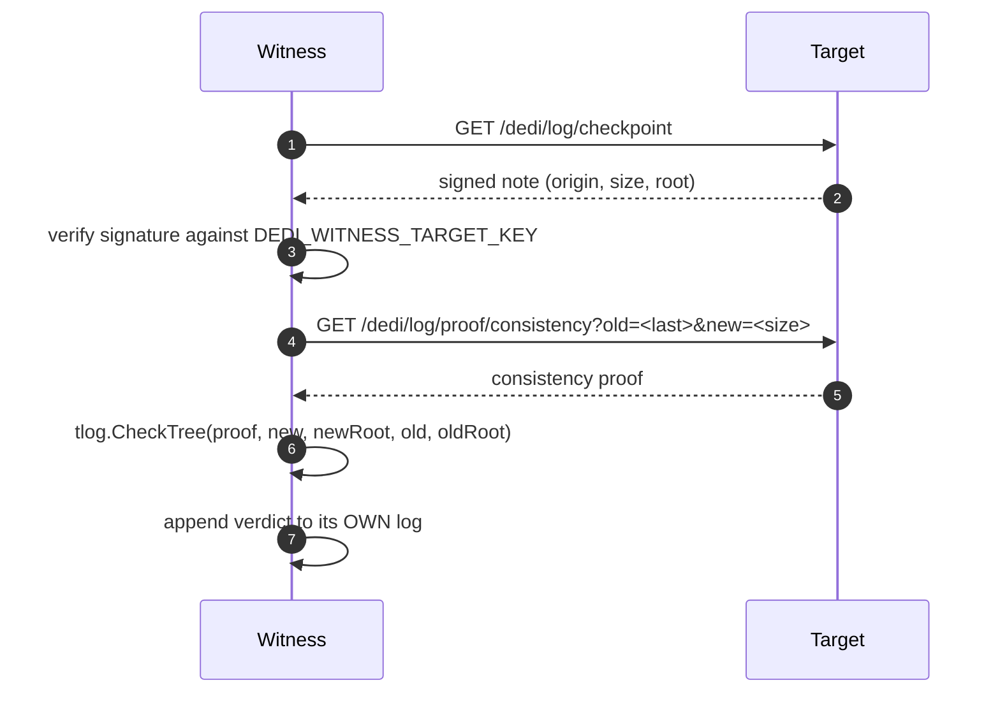

# Witnessing

One node checking, on a schedule, that another node's log has only ever been
appended to — and recording what it found in its own log, where the target
cannot reach it. This is the part of the design that turns "trust the operator"
into "check the operator", and it is the reason a DeDi node is worth more than
a well-run database.

Status: implemented. Turn it on with `DEDI_WITNESS_TARGET_*`; see
[deployment modes](/docs/deployment-modes) for how the planes compose.

## The problem it solves

A transparency log makes a node's history *checkable*. It does not make it
*checked*.

A node signs a checkpoint over its Merkle tree, and anyone holding two
checkpoints can demand a consistency proof between them. That is a real
guarantee, but it only binds an operator who is being watched — and the party
best placed to watch is the one least motivated to. If the only copies of
yesterday's checkpoint live on the node that issued it, an operator who rewrites
history has to fool nobody: they re-sign, and the new history is the only one
anyone has ever seen.

Witnessing fixes the custody problem, not the cryptography. Another node keeps
the old checkpoint, and it is the *keeping* that matters.

## What a witness actually does

Every `DEDI_WITNESS_INTERVAL` (default 60s):



The verdict is an ordinary record in the witness's log, under the reserved
`_witness` namespace, with `consistency_ok` in the payload. A failed check is
recorded with `state: revoked`, so an alarm is a published, signed, permanent
entry rather than a log line that scrolls away.

That last point is the whole design. The witness does not email anyone. It
writes down what it saw, in a log that is itself append-only and itself
witnessed, so the evidence outlives the incident and the person who noticed.

The check runs every interval, but a consistent verdict is written at most once
per `DEDI_WITNESS_RECORD_INTERVAL` (default `1h`; `0` writes every change). An
alarm is written at once, whatever the interval. Without this a ring floods
itself: each verdict grows the witness's own tree, its own watcher sees that as
a change and writes a verdict, and so on round the ring every minute.

Every check proves the new checkpoint consistent with the newest written
verdict, so each written "ok" is consistent with the one before it and the log
alone is a checkable chain. Between written verdicts the witness also proves
from the last tree it checked, held in memory, so a rewrite of entries it saw
but had not yet written down is still caught. When that is how an alarm is
found, the witness first writes the tree it saw as "ok" (it was proven
consistent with the verdict that was newest when it was seen), then the alarm,
so the contradicting pair is in the log for anyone to re-check. Just before
writing, it reads the log again and writes nothing if another verdict has
landed meanwhile; that narrows the window for a concurrent writer to slip in
between, but does not close it.

The memory is not durable. After a restart, a crash or a cluster leader change,
or once another loop writes a verdict for the same target, it is dropped: up
to `DEDI_WITNESS_RECORD_INTERVAL` of checked but unwritten history is lost, and
a rewrite confined to that span is not alarmed afterwards. Child witness loops
(see [delegation](delegation.md)) use the same setting.

A verdict is **not a cosignature**. The witness does not sign the target's
checkpoint (C2SP `tlog-witness` is not implemented), so nobody can hand you a
checkpoint that carries the witness's signature. A verdict is useful when you
compare it: the `size` and `root` it records against the checkpoint you were
served, or by redoing the check ([below](#checking-it-yourself)). It also
cannot see a split view: a target could show the witness one history and you
another, and only a comparison catches that.

## The three failures it is built to catch

**The tree shrank.** `size < last` is impossible for an append-only log. No
proof is fetched; the verdict is `consistency_ok: false` immediately.

**The tree grew, but not from what was there before.** This is what the RFC 6962
consistency proof answers, and `tlog.CheckTree` is the check. If the old root is
not derivable as a prefix of the new tree, something was edited on the way past.

**The tree did not move, but its contents changed.** The subtle one, and the
attack that needs no growth at all: swap a leaf, re-sign at the same height. A
witness that compares sizes sees a quiet period and skips the check. So an
unchanged size is only treated as unchanged if the *root* still agrees:

> a matching size with a different root is not a quiet period, it is
> equivocation

and it is recorded as an alarm rather than skipped. The comment saying so is in
`internal/witness/witness.go`, at the branch that does it.

## A stalled witness is not a passing witness

The failure mode that nearly got past us: a witness records `consistency_ok:
true`, then starts failing on every subsequent run — network, key rotation,
target moved — and its stored verdict keeps saying `consistency_ok: true`
forever. Every dashboard reading verdicts stays green while nothing is being
checked.

Verdict age cannot distinguish the two. A witness writes nothing while its
target's tree is unchanged, and at most one consistent verdict per record
interval while it grows, so the newest verdict is legitimately hours old.

So the node reports its own liveness separately, at `/dedi/network`:

```json
"witness_health": {
  "checking": true,
  "attempts": 413,
  "failures": 0,
  "interval_seconds": 60,
  "last_success_at": "2026-08-16T18:09:18Z",
  "seconds_since_success": 14,
  "stale": false
}
```

`stale` is the node's own judgment, at three intervals — decided by the node so
that a monitor and the node's own page can never disagree about what counts as
late. Monitor `checking` and `stale`, not the age of the newest verdict.

A stalled witness should read as **degraded**, not down: reads are unaffected,
and what has been lost is the freshness of a proof rather than the registry.

## Why consistent verdicts are rate-limited

A witness used to append a verdict whenever its target's tree moved. In a ring
the target's tree moves *because* it appended a verdict about the next node, so
every node appended a verdict round the ring every minute or so, forever, even
when no directory data changed at all.

On the public node that came to 22,005 of 22,047 log entries, about **99.8%**
of the log. Every one was a real, valid check, but the log was mostly
bookkeeping. `DEDI_WITNESS_RECORD_INTERVAL` (above) caps consistent verdicts at
one per interval per target, which ends the cycle; checking still happens every
`DEDI_WITNESS_INTERVAL`. The verdicts already written stay where they are: the
log is append-only.

## Turning it on

```
DEDI_WITNESS_TARGET_URL=https://node-b.example/dedi     # note the /dedi suffix
DEDI_WITNESS_TARGET_KEY=<the target's verifier key>     # sumdb/note format
DEDI_WITNESS_TARGET_ORIGIN=node-b.example/log           # the target's log origin
DEDI_WITNESS_INTERVAL=60s                               # optional
DEDI_WITNESS_RECORD_INTERVAL=1h                         # optional
```

`DEDI_WITNESS_TARGET_ORIGIN` must equal the first line of the target's
checkpoint, exactly:

```sh
curl -s https://node-b.example/dedi/log/checkpoint | head -1
```

Get the key from the target operator. The target shows it on its `/` page (and
prints it in its boot log), in the note format this variable takes (the
manifest at `/.well-known/dedi.index.json` carries the same public key as a
JWK, which is a different encoding). Verifying a checkpoint against a key the target
handed you over the same connection proves nothing about the target; it proves
the connection. The key should reach you by a path the target does not control
— which in practice means out of band, once, and pinned thereafter.

## Rings, not pairs

Two nodes witnessing each other is better than one node witnessing nobody, but
it is still a closed pair: the two operators can agree to lie together.

The demo network runs a ring — A watches B, B watches C, C watches A — so every
node is watched by exactly one other and none is privileged. A ring of *n*
requires all *n* operators to collude, and each additional independent operator
raises the cost of collusion without any node gaining authority over another.

Nothing in the code knows about rings. A ring is what you get from pointing each
node's `DEDI_WITNESS_TARGET_*` at the next one; the topology is a deployment
choice, and a star, a mesh or a chain all work the same way.

Witnessing is deliberately **not** the same relationship as replication. Raft
replicas share an identity key and prove nothing about each other — they are one
node that survives a machine dying. See [replication](/docs/replication) for why
those two are different failure domains and why conflating them on a status page
gives false comfort.

## Reading a verdict

Everything this node has verified, about everyone:

```sh
curl -s https://node-a.example/dedi/witness | jq .data
```

```json
{
  "witness": "node-a.example/log",
  "total": 1,
  "consistent": 1,
  "targets": [
    {
      "origin": "node-b.example/log",
      "target_url": "https://node-b.example/dedi",
      "target_key": "node-b.example+7f3a1c9d+Aa4b…",
      "witnessed": true,
      "consistency_ok": true,
      "size": 1744,
      "root": "D3lzRh1lbCP9+1sriWOkVKeb++ITYno0CW50OON14K4=",
      "state": "live",
      "verdict_at": "2026-08-18T04:11:07Z",
      "version_num": 1743,
      "health": { "checking": true, "stale": false, "seconds_since_success": 21 },
      "verdict_url": "/dedi/witness/node-b.example%2Flog"
    }
  ]
}
```

Follow `verdict_url` for one target and the response additionally carries the
**inclusion proof of the verdict itself** — the leaf index, tree size and
checkpoint that pin this conclusion to a position in node A's own log. That is
the difference between a verdict and an assertion over HTTP: with the proof, A
cannot show you `consistency_ok: true` and someone else a different answer
without the two checkpoints disagreeing.

Three fields exist so you can leave this node behind entirely. `target_url` and
`target_key` are where to fetch B's checkpoint and the key to check its
signature with; `size` and `root` are what A claims it verified. Together they
are everything needed to [redo the check yourself](#checking-it-yourself).

### `witnessed` and `consistency_ok` are different questions

`witnessed: false` means there is a target here that has never been successfully
checked — enrolled, configured, never verified. It is deliberately not the same
shape as a failure, and neither one counts toward `consistent`.

Reducing with something like `.consistency_ok // true` would quietly turn "never
verified" into "verified fine", which is the one wrong answer this endpoint
exists to prevent. `consistent` is computed server-side so a monitor does not
have to reimplement that reduction and get it subtly wrong.

### The verdict is also in the log

`/dedi/witness` is a view. The underlying entries live in the reserved
`_witness` namespace, and `_`-prefixed namespaces stay hidden from the spec read
endpoints (`/dedi/lookup`, `/dedi/query`, `/dedi/versions`) so a crawler reading
the standard's endpoints does not index a node's bookkeeping as directory data.
`?internal=1` is the escape hatch, and it is how you get the **version history**
— one version per time the target's tree moved, which is the audit trail:

```sh
ORIGIN=$(python3 -c "import urllib.parse,sys;print(urllib.parse.quote(sys.argv[1],safe=''))" \
         "node-b.example/log")
curl -s "https://node-a.example/dedi/versions/_witness/$ORIGIN/checkpoint?internal=1"
```

That flag used to be the *only* way to read a verdict at all, which was
backwards: the one internal namespace a stranger is supposed to read sat behind
a parameter named `internal`, and omitting it returned a 404 indistinguishable
from "this node witnesses nobody". Our own status page's witness monitors were
built without it and sat amber, apparently reporting a broken ring, for as long
as nobody asked why — and an earlier draft of this page concluded from the same
404 that verdicts were unreadable, which was wrong. `/dedi/witness`
(issue #27) is the fix:
the claim is published under a name that says what it is, and the hiding rule is
left exactly as it was.

### Checking it yourself

Do not stop at `consistency_ok: true`. That is this node's assertion, and taking
it on faith is the habit witnessing exists to replace. The verdict carries the
size and root it checked, so fetch the target's own checkpoint and its
consistency proof and recompute:

```sh
curl -s https://node-b.example/dedi/log/checkpoint
curl -s "https://node-b.example/dedi/log/proof/consistency?old=<size>&new=<newer>"
```

Verify the checkpoint signature against the target's key, then run the RFC 6962
check. If that agrees, you have established the append-only property yourself,
with the witness in the path only as a source of the older checkpoint — which is
the entire job the witness was doing for you.
